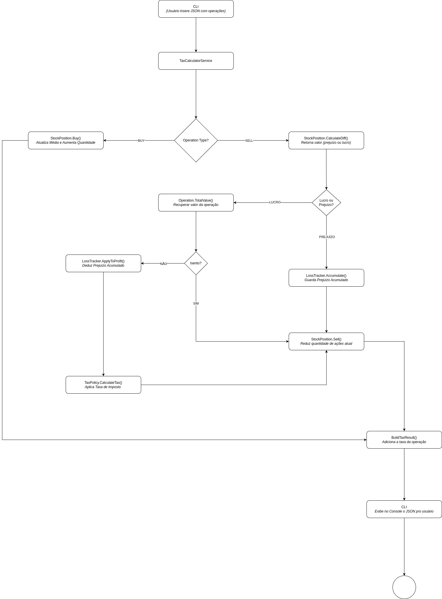

 # Code Challenge: Ganho de Capital

 Este projeto tem como objetivo apresentar um programa de linha de comando (CLI) que calcula o imposto a ser pago sobre lucros ou prejuízos de operações do mercado financeiro de ações.
<br>


## 🏛️ Padrão Arquitetural

- DDD (Domain-Driven Design): Domínio bem modelado com entidades, value objects, serviços de domínio.
- Arquitetura em Camadas: Separação clara entre Domain, Application, e Presentation (CLI).
- Clean Architecture: Independência entre camadas, cada uma com suas responsabilidades.
- Dependency Injection: Uso de injeção de dependência para manter baixo acoplamento.
- SOLID Principles: Aplicação de princípios de design para código limpo.
- Testes (TDD)	Testes unitários e integração.

**OBSERVAÇÕES:**
Foi realizado apenas o teste de integração para o *TaxCalculatorService* pois ele cobre todos os cenbários pertinentes que os testes de unidades feitos não cobrem. Como não há integrações nos outros services e afins (StockPosition, LossTracker), não vi necessidade de fazer teste de integrações para eles. 

Outro ponto importante, utilizei o docker porque acredito que é mais simples pra rodar, não havendo necessidade de ter que instalar o ecossistema do .NET.

**Tempo de Desenvolvimento:**
Horas Totais: 20 horas e 14min
6 horas e 13 minutos - Entendimento, Análise e Desenho
8 horas e 22 minutos - Elaboração e Escrita dos Testes
5 horas e 39 minutos - Codificação do Projeto (Estruturação Pastas, Implementação da Lógica, DI's, Etc)

**Os principais erros que cometi:**
- Estado compartilhado no teste de integração, o que resultou em um case influenciando no outro e meus testes falhando. Isso me gerou muito tempo nos testes debugando e entendendo o que estava acontecendo.
- Inicialmente comecei desenhando uma arquitetura complexa, para demonstrar habilidades tecnicas com mensageria, etc, não me atentei as recomendações no final do PDF e nem me recordei do meu mantra desde a faculdade "MENOS É MAIS". Isso me gerou um pequeno retrabalho, nada muito significativo pois foi bem nas horas iniciais.
- Escrevi testes de integração desnecessários, revisando o projeto depois percebi que eram inuteis, não havia integrações externas e os testes de unidade já os cobriam. Poderia ter usado esse tempo nos funcionais
- Não foram adicionados testes funcionais pois não deu tempo, investi muitas horas entendendo o projeto, desenhando e melhorando os testes bases (unitários e de integração).

**Upgrade que eu faria:** BDD -> Testes Funcionais com SpecFlow

### Organização Projeto
```
Directory structure:
└── CapitalGainsCalculator/
     ├── CapitalGainsCalculator.sln
     ├── CapitalGainsCalculator.sln.DotSettings.user
     ├── Dockerfile
     ├── README.md
     ├── capital-gains-calculator.drawio
     ├── capital-gains-calculator.jpg
     ├── src/
     │    ├── CapitalGainsCalculator.Application/
     │    │    ├── CapitalGainsCalculator.Application.csproj
     │    │    └── services/
     │    │         ├── DefaultTaxPolicy.cs
     │    │         ├── ITaxCalculatorService.cs
     │    │         ├── ITaxPolicy.cs
     │    │         └── TaxCalculatorService.cs
     │    ├── CapitalGainsCalculator.CLI/
     │    │    ├── CapitalGainsCalculator.CLI.csproj
     │    │    ├── Program.cs
     │    │    ├── Utils/
     │    │    │    └── ConsoleUI.cs
     │    └── CapitalGainsCalculator.Domain/
     │         ├── CapitalGainsCalculator.Domain.csproj
     │         ├── Entities/
     │         │    ├── Operation.cs
     │         │    └── TaxResult.cs
     │         ├── Enums/
     │         │    └── OperationType.cs
     │         ├── Services/
     │         │    ├── ILossTrackerService.cs
     │         │    └── LossTrackerService.cs
     │         ├── ValueObjects/
     │         │    └── StockPosition.cs
     └── tests/
          ├── CapitalGainsCalculator.IntegrationTests/
          │    ├── CapitalGainsCalculator.IntegrationTests.csproj
          │    └── src/
          │         └── Application/
          │              └── Services/
          │                   ├── TaxCalculatorFixture.cs
          │                   ├── TaxCalculatorServiceTests.cs
          │                   └── TestCaseData.cs
          └── CapitalGainsCalculator.UnitTests/
               ├── CapitalGainsCalculator.UnitTests.csproj
               └── src/
                    ├── Application/
                    │    └── Services/
                    │         ├── DefaultTaxPolicyTests.cs
                    │         └── TaxCalculatorServiceTests.cs
                    ├── CLI/
                    └── Domain/
                         ├── Entities/
                         │    ├── OperationTests.cs
                         │    └── TaxResultTests.cs
                         ├── Services/
                         │    └── LossTrackerServiceTests.cs
                         └── ValueObjects/
                              └── StockPositionTests.cs
``` 


## 🐳 Executando com Docker

**🔧 Pré-requisitos:** Você precisa ter **Docker** e **Docker Compose** instalados.

#### 👉 Instalação no Windows

1. Baixe e instale o [Docker Desktop para Windows](https://www.docker.com/products/docker-desktop).
2. Reinicie o sistema se necessário.
3. Verifique a instalação:

```bash
docker -v
docker-compose -v
``` 

#### 🐧 Instalação no Linux (Ubuntu/Debian)
```bash
sudo apt update
sudo apt install -y docker.io docker-compose
sudo usermod -aG docker $USER
newgrp docker

```
Verifique a instalação:

```bash
docker -v
docker-compose -v
```

#### 🍎 Instalação no macOS
1. Baixe e instale o [Docker Desktop](https://www.docker.com/products/docker-desktop).
2.Instale e inicie o app.
3.Verifique:
```bash
docker -v
docker-compose -v
```

### Rodando a Aplicação
**🔨 Build do Projeto**
```bash 
docker-compose build
``` 
**🚀 Rodar a Aplicação (CLI)**
```bash
docker-compose run --rm app
```
**🧪 Rodar Testes Unitários**
```bash
docker-compose run --rm unit-tests
```
**🔄 Testes de Integração**
```bash
docker-compose run --rm integration-tests
```

## Dados do PDF para "Brincar"

É importante ter atenção na maneira como é inserido o json no terminal. Respeitando o que foi explicitado no pdf a aplicação não está tratando como esse json é recebido, é adotado que o usuário irá colar certo.

```bash 
[{"operation":"buy", "unit-cost":10.00, "quantity": 10000},{"operation":"sell", "unit-cost":20.00, "quantity": 5000}]
[{"operation":"buy", "unit-cost":20.00, "quantity": 10000},{"operation":"sell", "unit-cost":10.00, "quantity": 5000}]
``` 

Espere por isso:
```bash 
[{"tax": 0.0}, {"tax": 10000.0}]
[{"tax": 0.0}, {"tax": 0.0}]
``` 